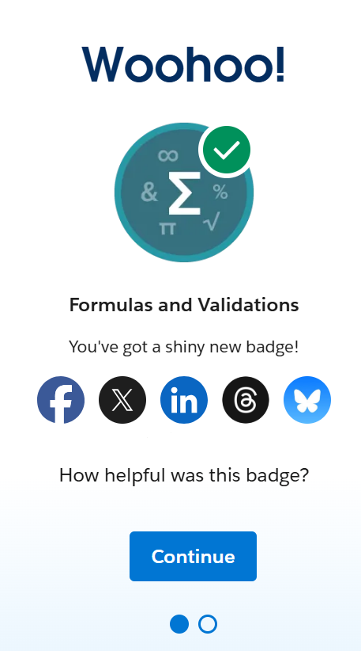
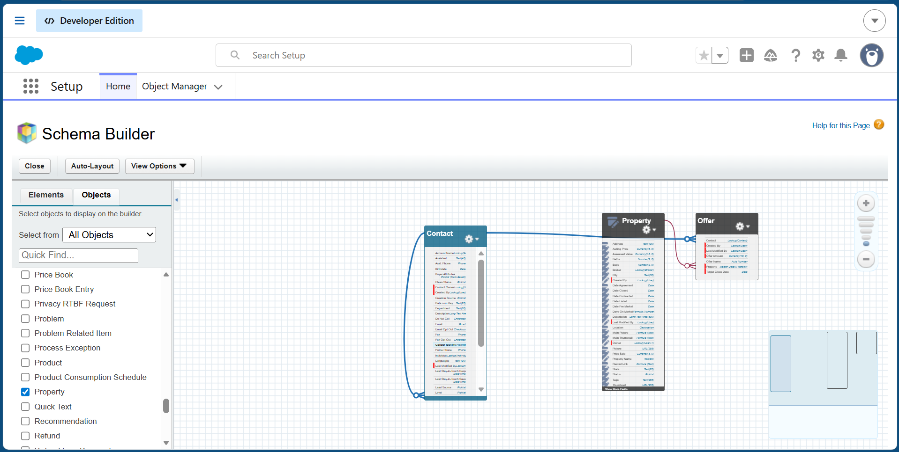
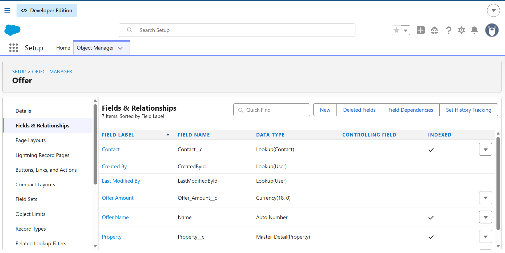

# Salesforce Summer Program – Day 3
# 📌 Difference Between App, Object, Record, and Field

| Feature | App | Object | Record | Field |
|---|---|---|---|---|
| Definition | Collection of related tools and objects | Database table that stores data | Single entry inside an object | Individual data attribute |
| Purpose | Organizes business functionality | Stores business information | Represents one data item | Stores specific information |
| Similar To | Software module | Table in database | Row in table | Column in table |
| Contains | Tabs, Objects, Reports | Fields and Records | Field values | Data values |
| Example | Sales App | Student Object | Student Rahul | Student Name |
| Used By | End Users | Admins & Developers | Users | Users & System |

---

## ✅ Examples

### App Example
Sales App contains:
- Accounts
- Contacts
- Opportunities

---

### Object Example
Student Object stores:
- Student Name
- Roll Number
- Email

---

### Record Example

| Student Name | Roll Number |
|---|---|
| Rahul | 101 |

This row is called a Record.

---

### Field Example
Fields inside Student Object:
- Name
- Age
- Email
- Phone Number
---

# 📌 Standard vs Custom Objects

## Standard Objects
Objects already provided by Salesforce.

### Examples:
- Account
- Contact
- Opportunity
- Lead

Used for common CRM processes.

---

## Custom Objects
Objects created by developers or admins based on business requirements.

### Examples:
- Student
- Department
- Library Book
- Attendance

Custom objects help organizations build their own systems.

---

# 📌 College Management System Data Model

## Objects Created
1. Student
2. Faculty
3. Course
4. Department

---

# 📌 Relationships Between Objects

## 1. Department → Faculty
One Department can have many Faculty members.

Relationship Type:
Lookup Relationship

---

## 2. Department → Course
One Department can offer many Courses.

Relationship Type:
Lookup Relationship

---

## 3. Course → Student
One Course can have many Students.

Relationship Type:
Lookup Relationship

---

## 4. Faculty → Course
One Faculty member can teach many Courses.

Relationship Type:
Lookup Relationship

---

# 📌 Simple Relationship Diagram

Department
│
├── Faculty
│
├── Course
      │
      └── Student

---

# 📌 Formula Fields

## 1. Full Name
Formula:
First Name + Last Name

### Why?
Automatically combines names and reduces manual work.

---

## 2. Remaining Seats
Formula:
Total Seats - Enrolled Students

### Why?
Automatically shows available seats without manual calculation.

---

## 3. Percentage
Formula:
(Obtained Marks / Total Marks) * 100

### Why?
Reduces calculation errors and updates automatically.

---

# 📌 Validation Rules

## 1. Email Cannot Be Empty

### Prevents:
Saving student records without email addresses.

### Benefit:
Ensures proper communication.

---

## 2. Student Age Cannot Be Negative

### Prevents:
Invalid age values like -5.

### Benefit:
Maintains correct student data.

---

## 3. Course Seats Cannot Exceed Limit

### Prevents:
Overbooking students into courses.

### Benefit:
Maintains proper seat allocation.

---

# 📌 Reflection – Why Structured Data Matters

Companies cannot manage large systems using random spreadsheets because:

- Data becomes inconsistent
- Duplicate entries increase
- Relationships are difficult to maintain
- Security becomes weak
- Reporting becomes difficult
- Automation is not possible

Structured enterprise systems help companies:
- Store data properly
- Maintain relationships
- Generate reports
- Automate processes
- Improve accuracy
- Scale business operations efficiently

---

# 📌 Why Relationships Are Important

Relationships connect different objects together.

### Example:
- A Student belongs to a Course
- A Course belongs to a Department

Without relationships:
- Data becomes isolated
- Duplicate information increases
- Business processes become confusing

Relationships help create real-world business systems.

---

# 📌 Formula Fields vs Validation Rules

| Formula Fields | Validation Rules |
|---|---|
| Used for calculations | Used for restrictions |
| Automatically calculate values | Prevent invalid data |
| Read-only values | Shows error messages |
| Example: Percentage | Example: Age cannot be negative |

---

# 📌 Why Salesforce is Metadata-Driven

Salesforce is called metadata-driven because:
- Most customization happens without changing core code
- Admins configure apps, objects, fields, and automation using metadata
- Salesforce stores configuration information separately from actual data

This makes Salesforce:
- Flexible
- Scalable
- Easy to customize

---

# 📌 What I Learned Today

- Objects, Fields, and Records
- Standard vs Custom Objects
- Lookup Relationships
- Formula Fields
- Validation Rules
- Importance of structured enterprise data
- Business logic without coding

---
# 📸 Screenshots

## Formulas and Validations Badge

---

## Schema Builder Relationships

---

## Offer Object Relationships

